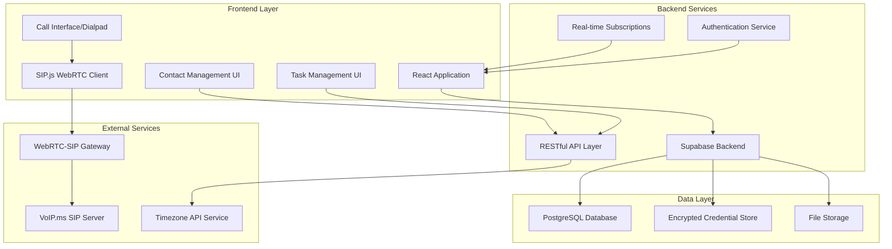

# Design Document - VoIP Web Calling App with Contact Management

## Overview

### Executive Summary

This design document outlines the technical architecture for a web-based VoIP calling application with integrated contact management capabilities. The system will integrate with VoIP.ms services to provide seamless browser-based calling while offering comprehensive contact organization, task management, and call tracking features optimized for timezone-based batch calling workflows.

**Key Architectural Decisions:**
- **Database**: Supabase for real-time data synchronization, authentication, and PostgreSQL features
- **Frontend**: Next.js (App Router) with React and SIP.js for WebRTC-based calling functionality
- **VoIP Integration**: WebRTC-SIP gateway connecting to VoIP.ms infrastructure
- **Real-time Features**: Supabase real-time subscriptions for live call status updates

**Business Value:**
- Streamlines sales/outreach workflows by eliminating application switching
- Provides timezone-aware contact organization for international calling
- Offers comprehensive call tracking and task management
- Enables secure, browser-based VoIP calling without software installation

**Implementation Timeline:**
- Phase 1 (4 weeks): Core infrastructure, authentication, basic contact management
- Phase 2 (3 weeks): VoIP integration, calling interface, call status tracking
- Phase 3 (3 weeks): Advanced features, timezone organization, data import/export
- Phase 4 (2 weeks): UI optimization, security hardening, testing

## Architecture

### System Architecture



### Technology Stack

**Frontend Technologies:**
- **Next.js 14 (App Router)**: Full-stack React framework with built-in optimizations and API routes
- **React 18**: Component-based UI with concurrent features for responsive interfaces
- **TypeScript**: Type safety for complex calling and contact management logic
- **SIP.js**: WebRTC signaling library for browser-based VoIP calling
- **Tailwind CSS**: Utility-first CSS framework for responsive design
- **React Query**: Data fetching and caching for contact and call data
- **Zustand**: Lightweight state management for call state and UI interactions

**Backend Infrastructure:**
- **Supabase**: Backend-as-a-Service providing PostgreSQL, real-time, and authentication
- **PostgreSQL**: Relational database with JSONB support for flexible contact data
- **Row Level Security (RLS)**: Database-level security for multi-tenant data isolation
- **Supabase Edge Functions**: Serverless functions for VoIP credential encryption and API integrations

**Integration Services:**
- **WebRTC-SIP Gateway**: Protocol bridge between browser WebRTC and VoIP.ms SIP infrastructure
- **VoIP.ms REST API**: Account management, DID information, and call routing
- **Timezone API**: Country code detection and timezone calculation services

### Next.js Architecture Benefits

**Framework Selection Rationale:**
- **Performance Optimization**: Built-in code splitting, image optimization, and font loading for sub-3-second load time requirement
- **Developer Experience**: Excellent TypeScript support, hot reloading, and debugging tools
- **API Integration**: Built-in API routes for VoIP.ms integration and webhook handling
- **Security Features**: CSRF protection, secure headers, and authentication integration
- **Scalability**: Easy deployment with Vercel, edge function support, and CDN optimization

**App Router Architecture:**
- **Client-Side Rendering**: Primary calling interface operates as SPA for real-time responsiveness
- **Server Components**: Authentication pages and data-heavy views use server-side rendering
- **API Routes**: VoIP.ms integration, CSV processing, and Supabase operations
- **Edge Functions**: Timezone detection and real-time data processing at the edge

### Deployment Architecture

**Production Environment:**
- **Frontend**: Next.js deployment on Vercel with CDN distribution, edge functions, and automatic SSL
- **Database**: Supabase managed PostgreSQL with automatic backups and scaling
- **WebRTC Gateway**: Dedicated server instance with SIP proxy capabilities
- **Monitoring**: Supabase analytics plus custom call quality metrics

**Security Infrastructure:**
- **HTTPS Everywhere**: All communications encrypted in transit
- **Supabase Auth**: JWT-based authentication with refresh token rotation
- **Credential Encryption**: AES-256 encryption for VoIP.ms credentials using Supabase Vault
- **Database Security**: Row Level Security policies for data isolation

### Scalability Considerations

**Database Optimization:**
- Indexing strategy for contact searches by phone number, country code, and timezone
- Partitioning for call history tables by date ranges
- Materialized views for timezone-based contact groupings
- Connection pooling through Supabase's PgBouncer integration

**Real-time Performance:**
- Supabase real-time subscriptions for call status updates
- WebSocket connections for live call state synchronization
- Optimistic UI updates for responsive contact interactions
- Background data synchronization for offline-first capabilities

## Components and Interfaces

### Core Components

#### Contact Management Component
```typescript
interface ContactManagementProps {
  contacts: Contact[]
  onContactSelect: (contact: Contact) => void
  onPhoneNumberCall: (phoneNumber: string, contactId: string) => void
  onBulkTaskCreate: (contactIds: string[]) => void
  filterOptions: ContactFilterOptions
}

interface Contact {
  id: string
  name: string
  email?: string
  company?: string
  phoneNumbers: PhoneNumber[]
  notes?: string
  createdAt: Date
  updatedAt: Date
  timezone?: string
  countryCode?: string
}

interface PhoneNumber {
  id: string
  number: string
  type: 'mobile' | 'work' | 'home' | 'other'
  isValid: boolean
  lastCalled?: Date
  callCount: number
  countryCode: string
}
```

#### VoIP Calling Component
```typescript
interface VoIPCallingProps {
  phoneNumber: string
  contact?: Contact
  onCallStart: (callData: CallSession) => void
  onCallEnd: (callData: CallEndData) => void
  onCallStatusChange: (status: CallStatus) => void
}

interface CallSession {
  id: string
  contactId?: string
  phoneNumber: string
  startTime: Date
  status: CallStatus
  duration?: number
}

type CallStatus = 'idle' | 'connecting' | 'ringing' | 'connected' | 'ended' | 'failed'

interface CallEndData {
  sessionId: string
  endTime: Date
  duration: number
  outcome: 'completed' | 'no_answer' | 'busy' | 'failed'
  notes?: string
}
```

#### Task Management Component
```typescript
interface TaskManagementProps {
  tasks: Task[]
  onTaskCreate: (taskData: CreateTaskData) => void
  onTaskUpdate: (taskId: string, updates: Partial<Task>) => void
  onTaskComplete: (taskId: string, notes?: string) => void
}

interface Task {
  id: string
  contactId: string
  type: 'call' | 'follow_up' | 'email' | 'meeting'
  status: 'pending' | 'in_progress' | 'completed' | 'cancelled'
  priority: 'low' | 'medium' | 'high'
  dueDate?: Date
  notes?: string
  createdAt: Date
  completedAt?: Date
}
```

#### Dialpad Interface Component
```typescript
interface DialpadProps {
  onNumberInput: (digit: string) => void
  onCall: (phoneNumber: string) => void
  onEndCall: () => void
  currentNumber: string
  callStatus: CallStatus
  callDuration?: number
}

interface DialpadState {
  inputNumber: string
  isCallActive: boolean
  callStartTime?: Date
  currentCallId?: string
}
```

### Integration Interfaces

#### VoIP.ms Integration
```typescript
interface VoIPCredentials {
  username: string
  password: string
  serverUrl: string
  domain: string
}

interface VoIPService {
  authenticate(credentials: VoIPCredentials): Promise<AuthResult>
  initiateCall(phoneNumber: string): Promise<CallSession>
  endCall(sessionId: string): Promise<void>
  sendDTMF(sessionId: string, tone: string): Promise<void>
  getCallStatus(sessionId: string): Promise<CallStatus>
}
```

#### Supabase Integration
```typescript
interface SupabaseService {
  // Authentication
  signIn(email: string, password: string): Promise<AuthResult>
  signOut(): Promise<void>
  getCurrentUser(): Promise<User | null>
  
  // Real-time subscriptions
  subscribeToCallUpdates(callback: (update: CallUpdate) => void): Subscription
  subscribeToContactChanges(callback: (change: ContactChange) => void): Subscription
  
  // Data operations
  getContacts(filters?: ContactFilters): Promise<Contact[]>
  createContact(contactData: CreateContactData): Promise<Contact>
  updateContact(id: string, updates: Partial<Contact>): Promise<Contact>
  deleteContact(id: string): Promise<void>
}
```

### UI Component Specifications

#### Contact List View
- **Layout**: Responsive grid/list toggle with infinite scroll
- **Search**: Real-time search across name, phone, email, and company fields
- **Filtering**: By timezone, country code, call status, and task status
- **Actions**: Bulk selection for task creation, individual phone number calling
- **Phone Number Display**: Clickable buttons with clear call-to-action styling

#### Call Interface
- **Dialpad**: Mobile-style numeric keypad with haptic feedback simulation
- **Call Controls**: Answer, end, mute, hold, transfer buttons with visual feedback
- **Status Display**: Real-time call status with animated indicators
- **Timer**: Live call duration display with format MM:SS
- **Contact Info**: Caller/callee information overlay during active calls

#### Task Dashboard
- **Kanban Board**: Tasks organized by status (pending, in progress, completed)
- **Calendar View**: Due date visualization with timezone awareness
- **Quick Actions**: One-click task creation from contact interactions
- **Progress Tracking**: Visual indicators for task completion rates

## Data Models

### Supabase Database Schema

#### Core Tables

```sql
-- Users table (extends Supabase auth.users)
CREATE TABLE profiles (
    id UUID REFERENCES auth.users(id) PRIMARY KEY,
    email TEXT UNIQUE NOT NULL,
    full_name TEXT,
    avatar_url TEXT,
    timezone TEXT DEFAULT 'UTC',
    created_at TIMESTAMP WITH TIME ZONE DEFAULT NOW(),
    updated_at TIMESTAMP WITH TIME ZONE DEFAULT NOW()
);

-- VoIP credentials (encrypted)
CREATE TABLE voip_credentials (
    id UUID DEFAULT gen_random_uuid() PRIMARY KEY,
    user_id UUID REFERENCES profiles(id) ON DELETE CASCADE,
    provider TEXT NOT NULL DEFAULT 'voip.ms',
    username TEXT NOT NULL,
    encrypted_password TEXT NOT NULL,
    server_url TEXT NOT NULL,
    domain TEXT NOT NULL,
    is_active BOOLEAN DEFAULT TRUE,
    created_at TIMESTAMP WITH TIME ZONE DEFAULT NOW(),
    updated_at TIMESTAMP WITH TIME ZONE DEFAULT NOW()
);

-- Contacts table
CREATE TABLE contacts (
    id UUID DEFAULT gen_random_uuid() PRIMARY KEY,
    user_id UUID REFERENCES profiles(id) ON DELETE CASCADE,
    name TEXT NOT NULL,
    email TEXT,
    company TEXT,
    notes TEXT,
    timezone TEXT,
    country_code TEXT,
    import_source TEXT, -- 'csv', 'manual', 'api'
    import_batch_id UUID, -- Group contacts from same import
    created_at TIMESTAMP WITH TIME ZONE DEFAULT NOW(),
    updated_at TIMESTAMP WITH TIME ZONE DEFAULT NOW(),
    
    -- Indexes for performance
    CONSTRAINT unique_user_email UNIQUE(user_id, email)
);

-- Phone numbers table
CREATE TABLE phone_numbers (
    id UUID DEFAULT gen_random_uuid() PRIMARY KEY,
    contact_id UUID REFERENCES contacts(id) ON DELETE CASCADE,
    number TEXT NOT NULL,
    type TEXT CHECK (type IN ('mobile', 'work', 'home', 'other')) DEFAULT 'mobile',
    country_code TEXT NOT NULL,
    is_valid BOOLEAN DEFAULT NULL, -- NULL = unknown, TRUE/FALSE = validated
    is_primary BOOLEAN DEFAULT FALSE,
    last_called_at TIMESTAMP WITH TIME ZONE,
    call_count INTEGER DEFAULT 0,
    created_at TIMESTAMP WITH TIME ZONE DEFAULT NOW(),
    
    -- Ensure valid phone number format
    CONSTRAINT valid_phone_format CHECK (number ~ '^\+?[1-9]\d{1,14}$')
);

-- Call sessions table
CREATE TABLE call_sessions (
    id UUID DEFAULT gen_random_uuid() PRIMARY KEY,
    user_id UUID REFERENCES profiles(id) ON DELETE CASCADE,
    contact_id UUID REFERENCES contacts(id) ON DELETE SET NULL,
    phone_number_id UUID REFERENCES phone_numbers(id) ON DELETE SET NULL,
    phone_number TEXT NOT NULL, -- Denormalized for historical accuracy
    status TEXT CHECK (status IN ('connecting', 'ringing', 'connected', 'ended', 'failed')) NOT NULL,
    start_time TIMESTAMP WITH TIME ZONE DEFAULT NOW(),
    end_time TIMESTAMP WITH TIME ZONE,
    duration_seconds INTEGER,
    outcome TEXT CHECK (outcome IN ('completed', 'no_answer', 'busy', 'failed')),
    notes TEXT,
    call_quality_rating INTEGER CHECK (call_quality_rating BETWEEN 1 AND 5),
    
    -- SIP session data
    sip_session_id TEXT,
    sip_call_id TEXT,
    
    created_at TIMESTAMP WITH TIME ZONE DEFAULT NOW()
);

-- Tasks table
CREATE TABLE tasks (
    id UUID DEFAULT gen_random_uuid() PRIMARY KEY,
    user_id UUID REFERENCES profiles(id) ON DELETE CASCADE,
    contact_id UUID REFERENCES contacts(id) ON DELETE CASCADE,
    type TEXT CHECK (type IN ('call', 'follow_up', 'email', 'meeting')) NOT NULL,
    status TEXT CHECK (status IN ('pending', 'in_progress', 'completed', 'cancelled')) DEFAULT 'pending',
    priority TEXT CHECK (priority IN ('low', 'medium', 'high')) DEFAULT 'medium',
    title TEXT NOT NULL,
    description TEXT,
    due_date TIMESTAMP WITH TIME ZONE,
    completed_at TIMESTAMP WITH TIME ZONE,
    notes TEXT,
    created_at TIMESTAMP WITH TIME ZONE DEFAULT NOW(),
    updated_at TIMESTAMP WITH TIME ZONE DEFAULT NOW()
);

-- Import batches for tracking CSV uploads
CREATE TABLE import_batches (
    id UUID DEFAULT gen_random_uuid() PRIMARY KEY,
    user_id UUID REFERENCES profiles(id) ON DELETE CASCADE,
    filename TEXT NOT NULL,
    total_contacts INTEGER NOT NULL,
    successful_imports INTEGER NOT NULL,
    failed_imports INTEGER NOT NULL,
    duplicate_emails INTEGER DEFAULT 0,
    status TEXT CHECK (status IN ('processing', 'completed', 'failed')) DEFAULT 'processing',
    error_details JSONB,
    created_at TIMESTAMP WITH TIME ZONE DEFAULT NOW()
);
```

#### Indexes for Performance

```sql
-- Contact search optimization
CREATE INDEX idx_contacts_user_name ON contacts(user_id, name);
CREATE INDEX idx_contacts_user_email ON contacts(user_id, email);
CREATE INDEX idx_contacts_user_company ON contacts(user_id, company);
CREATE INDEX idx_contacts_timezone ON contacts(timezone);
CREATE INDEX idx_contacts_country_code ON contacts(country_code);

-- Phone number lookups
CREATE INDEX idx_phone_numbers_contact ON phone_numbers(contact_id);
CREATE INDEX idx_phone_numbers_country ON phone_numbers(country_code);
CREATE INDEX idx_phone_numbers_number ON phone_numbers(number);

-- Call history queries
CREATE INDEX idx_call_sessions_user_date ON call_sessions(user_id, start_time DESC);
CREATE INDEX idx_call_sessions_contact ON call_sessions(contact_id, start_time DESC);
CREATE INDEX idx_call_sessions_phone ON call_sessions(phone_number_id);

-- Task management
CREATE INDEX idx_tasks_user_status ON tasks(user_id, status);
CREATE INDEX idx_tasks_user_due_date ON tasks(user_id, due_date);
CREATE INDEX idx_tasks_contact ON tasks(contact_id);
```

#### Row Level Security Policies

```sql
-- Enable RLS on all tables
ALTER TABLE profiles ENABLE ROW LEVEL SECURITY;
ALTER TABLE contacts ENABLE ROW LEVEL SECURITY;
ALTER TABLE phone_numbers ENABLE ROW LEVEL SECURITY;
ALTER TABLE call_sessions ENABLE ROW LEVEL SECURITY;
ALTER TABLE tasks ENABLE ROW LEVEL SECURITY;
ALTER TABLE voip_credentials ENABLE ROW LEVEL SECURITY;
ALTER TABLE import_batches ENABLE ROW LEVEL SECURITY;

-- Profiles: Users can only access their own profile
CREATE POLICY "Users can view own profile" ON profiles FOR SELECT USING (auth.uid() = id);
CREATE POLICY "Users can update own profile" ON profiles FOR UPDATE USING (auth.uid() = id);

-- Contacts: Users can only access their own contacts
CREATE POLICY "Users can manage own contacts" ON contacts FOR ALL USING (auth.uid() = user_id);

-- Phone numbers: Access through contact ownership
CREATE POLICY "Users can manage phone numbers for own contacts" ON phone_numbers FOR ALL 
USING (EXISTS (SELECT 1 FROM contacts WHERE contacts.id = phone_numbers.contact_id AND contacts.user_id = auth.uid()));

-- Call sessions: Users can only access their own call data
CREATE POLICY "Users can manage own call sessions" ON call_sessions FOR ALL USING (auth.uid() = user_id);

-- Tasks: Users can only access their own tasks
CREATE POLICY "Users can manage own tasks" ON tasks FOR ALL USING (auth.uid() = user_id);

-- VoIP credentials: Users can only access their own credentials
CREATE POLICY "Users can manage own voip credentials" ON voip_credentials FOR ALL USING (auth.uid() = user_id);

-- Import batches: Users can only access their own import history
CREATE POLICY "Users can view own import batches" ON import_batches FOR ALL USING (auth.uid() = user_id);
```

### Data Validation and Constraints

#### Contact Data Validation
- **Email Format**: Standard email regex validation with optional field
- **Phone Number Format**: E.164 international format validation
- **Country Code Detection**: Automatic extraction from phone number prefix
- **Duplicate Handling**: Email-based deduplication with merge conflict resolution

#### Call Data Integrity
- **Session Tracking**: Unique SIP session IDs for call correlation
- **Duration Calculation**: Automatic computation from start/end timestamps
- **Status Transitions**: Enforced state machine for call status progression
- **Quality Metrics**: Optional user-provided call quality ratings

#### Task Management Rules
- **Due Date Validation**: Future dates only for task scheduling
- **Status Transitions**: Logical progression from pending → in_progress → completed
- **Contact Association**: Required contact relationship for all tasks
- **Priority Inheritance**: Automatic priority setting based on contact importance

## API Design

### RESTful API Endpoints

#### Authentication Endpoints
```typescript
// Next.js API Routes with Supabase Auth integration
POST /api/auth/login
POST /api/auth/logout
POST /api/auth/refresh
GET /api/auth/user
```

#### Contact Management API
```typescript
// Contacts CRUD
GET /api/contacts
POST /api/contacts
GET /api/contacts/:id
PUT /api/contacts/:id
DELETE /api/contacts/:id

// Phone numbers
POST /api/contacts/:id/phone-numbers
PUT /api/phone-numbers/:id
DELETE /api/phone-numbers/:id
PUT /api/phone-numbers/:id/validate

// Bulk operations
POST /api/contacts/import/csv
POST /api/contacts/bulk/tasks
GET /api/contacts/export/csv
```

#### VoIP Integration API
```typescript
// Credential management
POST /api/voip/credentials
GET /api/voip/credentials
PUT /api/voip/credentials/:id
DELETE /api/voip/credentials/:id
POST /api/voip/test-connection

// Call management
POST /api/calls/initiate
PUT /api/calls/:id/end
POST /api/calls/:id/dtmf
GET /api/calls/:id/status
GET /api/calls/history
```

#### Task Management API
```typescript
// Tasks CRUD
GET /api/tasks
POST /api/tasks
GET /api/tasks/:id
PUT /api/tasks/:id
DELETE /api/tasks/:id

// Task operations
PUT /api/tasks/:id/complete
PUT /api/tasks/:id/status
GET /api/tasks/statistics
```

#### Timezone and Utility API
```typescript
// Timezone services
GET /api/timezone/detect/:phoneNumber
GET /api/timezone/contacts/grouped
GET /api/timezone/optimal-calling-windows

// Import/Export
POST /api/import/csv/validate
GET /api/export/contacts/csv
GET /api/import/batches
GET /api/import/batches/:id/status
```

### Real-time WebSocket Events

#### Call Status Updates
```typescript
interface CallStatusUpdate {
  type: 'call_status_change'
  callId: string
  status: CallStatus
  timestamp: Date
  duration?: number
}

interface CallQualityUpdate {
  type: 'call_quality_update'
  callId: string
  metrics: {
    jitter: number
    packetLoss: number
    latency: number
  }
}
```

#### Contact and Task Synchronization
```typescript
interface ContactUpdate {
  type: 'contact_updated' | 'contact_created' | 'contact_deleted'
  contactId: string
  data?: Partial<Contact>
  timestamp: Date
}

interface TaskUpdate {
  type: 'task_status_changed' | 'task_created' | 'task_completed'
  taskId: string
  data?: Partial<Task>
  timestamp: Date
}
```

### API Response Formats

#### Standard Response Structure
```typescript
interface APIResponse<T> {
  success: boolean
  data?: T
  error?: {
    code: string
    message: string
    details?: any
  }
  pagination?: {
    page: number
    limit: number
    total: number
    hasNext: boolean
  }
  timestamp: Date
}
```

#### Error Handling Patterns
```typescript
interface APIError {
  code: 'VALIDATION_ERROR' | 'AUTHENTICATION_ERROR' | 'VOIP_ERROR' | 'RATE_LIMIT_ERROR'
  message: string
  field?: string // For validation errors
  retryAfter?: number // For rate limiting
  details?: Record<string, any>
}
```

## Error Handling

### Frontend Error Handling Strategy

#### Call-Related Errors
```typescript
interface CallErrorHandler {
  handleConnectionError(error: VoIPError): void
  handleAuthenticationError(error: AuthError): void
  handleNetworkError(error: NetworkError): void
  handleMediaError(error: MediaError): void
}

// Error recovery patterns
const callErrorRecovery = {
  CONNECTION_FAILED: () => {
    // Retry with exponential backoff
    // Show user connection troubleshooting
    // Offer alternative communication methods
  },
  AUTHENTICATION_FAILED: () => {
    // Prompt for credential update
    // Test connection with new credentials
    // Store validated credentials securely
  },
  MEDIA_PERMISSION_DENIED: () => {
    // Show browser permission instructions
    // Provide troubleshooting guide
    // Offer text/email alternatives
  }
}
```

#### Data Synchronization Errors
```typescript
interface DataErrorHandler {
  handleOfflineMode(): void
  handleSyncConflicts(conflicts: SyncConflict[]): void
  handleValidationErrors(errors: ValidationError[]): void
}

// Offline-first strategy
const offlineErrorHandling = {
  NETWORK_UNAVAILABLE: () => {
    // Queue operations for sync
    // Show offline mode indicator
    // Enable local data access
  },
  SYNC_CONFLICT: (conflict) => {
    // Present user with conflict resolution options
    // Implement last-writer-wins or user choice
    // Maintain conflict history for audit
  }
}
```

### Backend Error Handling

#### VoIP Integration Errors
```typescript
interface VoIPErrorTypes {
  INVALID_CREDENTIALS: 'credentials_invalid'
  SERVER_UNREACHABLE: 'server_unreachable'
  CALL_FAILED: 'call_failed'
  RATE_LIMITED: 'rate_limited'
  INSUFFICIENT_BALANCE: 'insufficient_balance'
}

// Error response mapping
const voipErrorMapping = {
  401: 'INVALID_CREDENTIALS',
  403: 'INSUFFICIENT_BALANCE',
  429: 'RATE_LIMITED',
  503: 'SERVER_UNREACHABLE'
}
```

#### Database Error Handling
```typescript
interface DatabaseErrorHandler {
  handleConnectionErrors(): void
  handleConstraintViolations(): void
  handleTransactionFailures(): void
}

// Supabase error patterns
const supabaseErrorHandling = {
  CONNECTION_ERROR: () => {
    // Implement connection retry logic
    // Use connection pooling
    // Fallback to cached data
  },
  CONSTRAINT_VIOLATION: (error) => {
    // Map database constraints to user-friendly messages
    // Provide data correction guidance
    // Suggest alternative actions
  }
}
```

### Error Monitoring and Logging

#### Error Tracking Integration
```typescript
interface ErrorTracker {
  logError(error: Error, context: ErrorContext): void
  logUserAction(action: UserAction): void
  logPerformanceMetric(metric: PerformanceMetric): void
}

interface ErrorContext {
  userId?: string
  contactId?: string
  callId?: string
  route: string
  userAgent: string
  timestamp: Date
}
```

#### Performance Monitoring
```typescript
interface PerformanceMonitor {
  trackCallQuality(metrics: CallQualityMetrics): void
  trackPageLoad(timing: NavigationTiming): void
  trackAPILatency(endpoint: string, duration: number): void
}

interface CallQualityMetrics {
  jitter: number
  packetLoss: number
  roundTripTime: number
  audioLevel: number
  callDuration: number
}
```

## Testing Strategy

### Frontend Testing Approach

#### Component Testing
```typescript
// Contact list component tests
describe('ContactList', () => {
  it('should display contacts with clickable phone numbers', () => {
    // Test phone number button rendering
    // Verify click handlers
    // Check accessibility attributes
  })
  
  it('should handle bulk selection for task creation', () => {
    // Test multi-select functionality
    // Verify task creation flow
    // Check state management
  })
})

// VoIP calling component tests
describe('VoIPCaller', () => {
  it('should initiate calls through SIP.js', () => {
    // Mock SIP.js interactions
    // Test call state transitions
    // Verify error handling
  })
  
  it('should display real-time call status', () => {
    // Test status indicator updates
    // Verify timer functionality
    // Check end call behavior
  })
})
```

#### Integration Testing
```typescript
// Supabase integration tests
describe('Supabase Integration', () => {
  it('should sync contact changes in real-time', () => {
    // Test real-time subscriptions
    // Verify data consistency
    // Check conflict resolution
  })
  
  it('should handle authentication flows', () => {
    // Test login/logout flows
    // Verify token refresh
    // Check security policies
  })
})
```

#### End-to-End Testing
```typescript
// Call workflow E2E tests
describe('Call Workflow', () => {
  it('should complete full calling sequence', () => {
    // Navigate to contact list
    // Click phone number
    // Verify call interface
    // End call and add notes
    // Check call history
  })
  
  it('should handle timezone-based batch calling', () => {
    // Filter contacts by timezone
    // Create batch tasks
    // Execute calls in sequence
    // Verify completion tracking
  })
})
```

### Backend Testing Strategy

#### API Testing
```typescript
// Contact API tests
describe('Contact API', () => {
  it('should import CSV with validation', () => {
    // Test file upload
    // Verify data validation
    // Check error reporting
    // Confirm import success
  })
  
  it('should handle duplicate email resolution', () => {
    // Import contacts with duplicate emails
    // Verify merge logic
    // Check phone number aggregation
    // Confirm data integrity
  })
})

// VoIP API tests
describe('VoIP API', () => {
  it('should authenticate with VoIP.ms', () => {
    // Test credential validation
    // Verify secure storage
    // Check connection establishment
  })
  
  it('should handle call state management', () => {
    // Test call initiation
    // Verify status updates
    // Check call termination
    // Confirm history logging
  })
})
```

#### Performance Testing
```typescript
// Load testing scenarios
describe('Performance Tests', () => {
  it('should handle concurrent users', () => {
    // Simulate multiple users calling
    // Test database connection pooling
    // Verify real-time performance
    // Check resource utilization
  })
  
  it('should maintain sub-3-second load times', () => {
    // Test page load performance
    // Measure time to interactive
    // Check bundle size optimization
    // Verify CDN effectiveness
  })
})
```

### Security Testing

#### Authentication Testing
```typescript
describe('Security Tests', () => {
  it('should protect against unauthorized access', () => {
    // Test RLS policies
    // Verify JWT validation
    // Check session management
    // Confirm data isolation
  })
  
  it('should encrypt sensitive data', () => {
    // Test VoIP credential encryption
    // Verify HTTPS enforcement
    // Check data at rest encryption
    // Confirm secure transmission
  })
})
```

#### VoIP Security Testing
```typescript
describe('VoIP Security', () => {
  it('should establish secure WebRTC connections', () => {
    // Test DTLS encryption
    // Verify SRTP implementation
    // Check certificate validation
    // Confirm secure signaling
  })
  
  it('should protect against SIP attacks', () => {
    // Test authentication bypass attempts
    // Verify rate limiting
    // Check injection protection
    // Confirm session security
  })
})
```

### Testing Infrastructure

#### Test Environment Setup
```typescript
// Test database configuration
const testConfig = {
  supabase: {
    url: process.env.SUPABASE_TEST_URL,
    anonKey: process.env.SUPABASE_TEST_ANON_KEY,
    serviceKey: process.env.SUPABASE_TEST_SERVICE_KEY
  },
  voip: {
    testCredentials: process.env.VOIP_TEST_CREDENTIALS,
    mockServer: process.env.VOIP_MOCK_SERVER
  }
}

// Mock services for testing
const mockServices = {
  voipService: jest.fn(),
  timezoneService: jest.fn(),
  smsService: jest.fn()
}
```

#### Continuous Integration
```yaml
# CI/CD pipeline configuration
name: Test and Deploy
on: [push, pull_request]
jobs:
  test:
    runs-on: ubuntu-latest
    services:
      postgres:
        image: postgres:14
        env:
          POSTGRES_PASSWORD: postgres
        options: >-
          --health-cmd pg_isready
          --health-interval 10s
          --health-timeout 5s
          --health-retries 5
    steps:
      - name: Checkout code
      - name: Setup Node.js
      - name: Install dependencies
      - name: Run unit tests
      - name: Run integration tests
      - name: Run E2E tests
      - name: Generate coverage report
      - name: Deploy to staging
```

This comprehensive design document provides the technical foundation for implementing the VoIP Web Calling App with Contact Management. The architecture leverages Supabase for robust backend services while maintaining security, performance, and scalability requirements. The detailed component specifications and API design enable development teams to implement the system systematically while ensuring all requirements are addressed.

Does the design look good? If so, we can move on to the implementation plan.